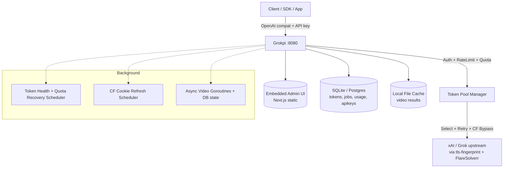

# Grokpi

**OpenAI-compatible self-hosted gateway for Grok (xAI) — chat, image, video, and TTS workloads with advanced token management, Cloudflare bypass, quotas, and an embedded admin UI.**

[](LICENSE)
[](go.mod)
[](web/package.json)

## Overview

Grokpi lets you run your own production-ready proxy in front of Grok models. It handles token rotation/pooling/quotas/health, automatic Cloudflare challenge solving (via FlareSolverr + browser fingerprinting), usage tracking, rate limiting, and provides a full-featured admin console — all in a single static binary.

Perfect for:
- Cost control & quota management across many accounts
- High-availability self-hosting
- Building apps on top of Grok without direct rate limits
- Teams that need audit logs, API keys, and video/image generation at scale

## Features

- Full OpenAI Chat Completions, Images, Audio (TTS) compatibility + Grok extensions
- Async video generation with job polling + cancellation (new)
- Powerful token pool (basic/super), smart selection, automatic cooling/recovery/health checks
- Cloudflare auto-refresh + tls-client fingerprinting
- Embedded Next.js admin UI (tokens, API keys, usage charts, config, cache browser)
- SQLite (default) or PostgreSQL
- Structured logging, usage buffering, graceful shutdown
- Docker + multi-arch releases via GitHub Actions (ghcr.io)
- Browser extension companion for easy token extraction

## Architecture



**Key components:**
- `internal/token/*` — pool, picker, quota, health, persist
- `internal/flow/*` — orchestration + retry + streaming for chat/image/video
- `internal/xai/*` — low-level resilient client
- `internal/httpapi/openai/*` — OpenAI wire format + admin
- `web/` — admin frontend (built & embedded)

---

## 1. What You Get (Core)

- OpenAI-compatible endpoints (`/v1/models`, `/v1/chat/completions`, `/v1/audio/speech`, async video)
- Admin console for token pools, API keys, usage, settings, and cache
- Single Go binary with embedded web app
- SQLite by default, optional PostgreSQL
- Docker Compose deployment support
- Health: `/health`, `/live`, `/ready`
- Full async video with cancel + retry (improved)

(The rest of the original detailed VPS guide follows below...)

## 2. Requirements

- Linux server or VPS (Ubuntu 22.04+ recommended)
- Docker + Docker Compose plugin
- Go 1.24+ and Node.js 20+ (required to build `bin/grokpi` for `Dockerfile.local`)
- `make` (optional but recommended)
- At least 2 vCPU / 2 GB RAM for light usage
- Open ports: `8080` (or reverse-proxy to 80/443)

Optional:

- Domain name + TLS certificate
- FlareSolverr and proxy config (only if your upstream route requires it)

### 2.1 Full Prerequisite Install (Ubuntu 22.04/24.04)

If you are new to server setup, run these steps first.

1. Update system packages:

```bash
sudo apt-get update
sudo apt-get upgrade -y
```

2. Install base tools:

```bash
sudo apt-get install -y ca-certificates curl gnupg lsb-release git make
```

3. Install Docker Engine + Docker Compose plugin (official Docker repo):

```bash
sudo install -m 0755 -d /etc/apt/keyrings
curl -fsSL https://download.docker.com/linux/ubuntu/gpg | sudo gpg --dearmor -o /etc/apt/keyrings/docker.gpg
sudo chmod a+r /etc/apt/keyrings/docker.gpg

echo \
  "deb [arch=$(dpkg --print-architecture) signed-by=/etc/apt/keyrings/docker.gpg] https://download.docker.com/linux/ubuntu \
  $(. /etc/os-release && echo $VERSION_CODENAME) stable" | \
  sudo tee /etc/apt/sources.list.d/docker.list > /dev/null

sudo apt-get update
sudo apt-get install -y docker-ce docker-ce-cli containerd.io docker-buildx-plugin docker-compose-plugin
```

4. (Recommended) Allow your current user to run Docker without `sudo`:

```bash
sudo usermod -aG docker "$USER"
newgrp docker
```

5. Install Node.js 20 LTS:

```bash
curl -fsSL https://deb.nodesource.com/setup_20.x | sudo -E bash -
sudo apt-get install -y nodejs
```

6. Install Go (match project requirement from `go.mod`, currently 1.24.1+):

```bash
GO_VERSION="1.24.1"
curl -fsSL "https://go.dev/dl/go${GO_VERSION}.linux-amd64.tar.gz" -o /tmp/go.tar.gz
sudo rm -rf /usr/local/go
sudo tar -C /usr/local -xzf /tmp/go.tar.gz
echo 'export PATH=$PATH:/usr/local/go/bin' >> ~/.bashrc
export PATH=$PATH:/usr/local/go/bin
```

7. Verify all tools are installed:

```bash
docker --version
docker compose version
node --version
npm --version
go version
make --version
```

If Docker still needs `sudo` after step 4, log out and log in again.

### 2.2 Full Prerequisite Install (Debian 12)

Use this section if your server runs Debian 12 (bookworm).

1. Update system packages:

```bash
sudo apt-get update
sudo apt-get upgrade -y
```

2. Install base tools:

```bash
sudo apt-get install -y ca-certificates curl gnupg lsb-release git make
```

3. Install Docker Engine + Docker Compose plugin (official Docker repo):

```bash
sudo install -m 0755 -d /etc/apt/keyrings
curl -fsSL https://download.docker.com/linux/debian/gpg | sudo gpg --dearmor -o /etc/apt/keyrings/docker.gpg
sudo chmod a+r /etc/apt/keyrings/docker.gpg

echo \
  "deb [arch=$(dpkg --print-architecture) signed-by=/etc/apt/keyrings/docker.gpg] https://download.docker.com/linux/debian \
  $(. /etc/os-release && echo $VERSION_CODENAME) stable" | \
  sudo tee /etc/apt/sources.list.d/docker.list > /dev/null

sudo apt-get update
sudo apt-get install -y docker-ce docker-ce-cli containerd.io docker-buildx-plugin docker-compose-plugin
```

4. (Recommended) Allow your current user to run Docker without `sudo`:

```bash
sudo usermod -aG docker "$USER"
newgrp docker
```

5. Install Node.js 20 LTS:

```bash
curl -fsSL https://deb.nodesource.com/setup_20.x | sudo -E bash -
sudo apt-get install -y nodejs
```

6. Install Go (match project requirement from `go.mod`, currently 1.24.1+):

```bash
GO_VERSION="1.24.1"
curl -fsSL "https://go.dev/dl/go${GO_VERSION}.linux-amd64.tar.gz" -o /tmp/go.tar.gz
sudo rm -rf /usr/local/go
sudo tar -C /usr/local -xzf /tmp/go.tar.gz
echo 'export PATH=$PATH:/usr/local/go/bin' >> ~/.bashrc
export PATH=$PATH:/usr/local/go/bin
```

7. Verify all tools are installed:

```bash
docker --version
docker compose version
node --version
npm --version
go version
make --version
```

If Docker still needs `sudo` after step 4, log out and log in again.

## 3. Quick Start (Docker Compose)

```bash
cd grokpi
cp config.defaults.toml config.toml
# set your admin password in config.toml: [app].app_key

# Build binary expected by Dockerfile.local (COPY bin/grokpi ...)
# Option A (recommended):
make build
# Option B (if make is unavailable):
# cd web && npm ci && npm run build && cd ..
# go build -o bin/grokpi ./cmd/grokpi

# Ensure mounted dirs are writable by container user (uid 1000)
mkdir -p data logs
sudo chown -R 1000:1000 data logs

docker compose up -d --build
curl -s http://127.0.0.1:8080/health
```

Open the browser:

- `http://YOUR_SERVER_IP:8080/login`

## 4. First-Time Setup in Admin Console

1. Sign in with `app_key`.
2. Add upstream tokens in Token Management.
3. Create an API key in API Keys.
4. Call `/v1/models` using your new API key.
5. Test chat/image/video requests.

## 5. Minimal Config Example

```toml
[app]
app_key = "CHANGE_ME_STRONG_PASSWORD"
host = "0.0.0.0"
port = 8080

db_driver = "sqlite"
db_path = "data/grokpi.db"

log_level = "info"
log_json = false

[proxy]
base_proxy_url = ""
asset_proxy_url = ""
enabled = false
```

Important notes:

- Empty `app_key` blocks admin access.
- Keep `config.toml` private.
- For public deployment, run behind TLS reverse proxy.

## 6. API Examples

### 6.1 List Models

```bash
curl -s http://127.0.0.1:8080/v1/models \
  -H "Authorization: Bearer YOUR_API_KEY"
```

### 6.2 Chat Completion

```bash
curl -s http://127.0.0.1:8080/v1/chat/completions \
  -H "Content-Type: application/json" \
  -H "Authorization: Bearer YOUR_API_KEY" \
  -d '{
    "model": "grok-3-mini",
    "messages": [
      {"role": "user", "content": "Hello from self-hosted Grokpi"}
    ]
  }'
```

### 6.3 Image Generation

```bash
curl -s http://127.0.0.1:8080/v1/chat/completions \
  -H "Content-Type: application/json" \
  -H "Authorization: Bearer YOUR_API_KEY" \
  -d '{
    "model": "grok-imagine-1.0",
    "messages": [
      {"role":"user","content":"A mountain lake at sunrise"}
    ],
    "image_config": {
      "aspect_ratio": "16:9"
    }
  }'
```

### 6.4 Video Generation

```bash
curl -s http://127.0.0.1:8080/v1/chat/completions \
  -H "Content-Type: application/json" \
  -H "Authorization: Bearer YOUR_API_KEY" \
  -d '{
    "model": "grok-imagine-1.0-video",
    "messages": [
      {"role":"user","content":"A cinematic drone shot over green rice fields"}
    ],
    "video_config": {
      "aspect_ratio": "16:9",
      "video_length": 8,
      "resolution_name": "480p",
      "preset": "normal"
    }
  }'
```

## 7. VPS Production Checklist

- Use reverse proxy (Nginx/Caddy/Traefik) in front of Grokpi
- Enable HTTPS (Let's Encrypt)
- Restrict admin endpoint exposure if possible
- Rotate API keys regularly
- Back up `data/` and `config.toml`
- Monitor container logs and restart policies

## 8. Updating Grokpi

```bash
git pull
# review config.defaults.toml changes if any

# rebuild local binary after code updates
make build
# or run manual build commands from section 3

docker compose up -d --build
curl -s http://127.0.0.1:8080/health
```

## 9. Backup and Restore

Backup:

```bash
tar czf grokpi-backup-$(date +%F).tar.gz config.toml data/
```

Restore:

```bash
tar xzf grokpi-backup-YYYY-MM-DD.tar.gz
# then restart
docker compose up -d --build
```

## 10. Common Issues

- `failed to solve ... "/bin/grokpi": not found` while `docker compose up --build`:
  - Build binary first (`make build` or manual commands in section 3).
- `failed to open database ... sqlite ... out of memory (14)` in container logs:
  - Usually host volume permission issue. Run `mkdir -p data logs && sudo chown -R 1000:1000 data logs`.
- `401` on admin login:
  - Check `app_key` in `config.toml`.
- `401 invalid_api_key` on `/v1/*`:
  - Use API key from Admin -> API Keys, not admin password.
- No model available:
  - Add/enable valid upstream tokens.
- Port `8080` already used:
  - Stop old container/process or change port mapping.

---

## Environment Variables

| Variable | Purpose | Default |
|----------|---------|---------|
| `GROKPI_TTS_API_KEY` / `XAI_API_KEY` | Server-side key for TTS upstream | (required for TTS) |
| `GROKPI_TTS_UPSTREAM_URL` | TTS endpoint | `https://api.x.ai/v1/tts` |
| `GROKPI_TTS_DEFAULT_*` | Voice/language/format fallbacks | eve / auto / mp3 |
| (others via config.toml or DB overrides) | - | - |

Never put real values in `config.toml` for production (use env + docker secrets or mounted files).

## Running Locally (Development)

See [CONTRIBUTING.md](CONTRIBUTING.md) for full dev guide.

Quick:
```bash
cp config.defaults.toml config.toml   # edit app_key + any proxy/flaresolverr
go run ./cmd/grokpi
# or
make build && ./bin/grokpi
```

Frontend rapid iteration (separate):
```bash
cd web && npm ci && npm run dev
```

## Docker Usage

```bash
cp config.defaults.toml config.toml
mkdir -p data logs
# chown as needed for container uid 1000
docker compose up -d --build
curl http://127.0.0.1:8080/ready
```

See `docker-compose.yml` (includes optional flaresolverr).

## Health Checks

- `GET /health` — detailed (db/tts/video status etc.)
- `GET /live` — liveness (K8s)
- `GET /ready` — readiness (K8s, 503 when not ready)

## Troubleshooting

See original sections 10 + new ones from audit:
- Video jobs stuck? Use the new `POST .../cancel` and check token video capability in admin.
- TTS not working? Ensure `GROKPI_TTS_API_KEY` is set in the environment (compose supports it).
- High memory? Review active video goroutines + token count.

## Deployment

- GitHub releases produce binaries + `ghcr.io/crmmc/grokpi` images on `v*` tags.
- Recommended: Caddy + automatic HTTPS in front.
- Backup: `data/` + `config.toml` (or use Postgres for HA).
- Monitor: `/ready`, logs, token health in admin.

## Contributing

See [CONTRIBUTING.md](CONTRIBUTING.md). Security first: never commit secrets.

## License

MIT — see [LICENSE](LICENSE).

---

**Full original self-hosting + VPS guide content preserved above for continuity.**
*This README was modernized (added Overview, Features, Architecture diagram, Env, Health, etc.) as part of the release mission.*

---

If you want, a dedicated step-by-step VPS guide (Ubuntu + Nginx + TLS + systemd + backup schedule) can be added next.

## 11. Local Development

See [CONTRIBUTING.md](CONTRIBUTING.md) for full development guide.

Quick local run (after `cp config.defaults.toml config.toml` and editing `app_key`):

```bash
# Backend only (uses embedded frontend from previous build, or stub)
go run ./cmd/grokpi

# Full build (frontend + backend)
make build
./bin/grokpi
```

Frontend-only rapid iteration (Next dev server, not embedded):

```bash
cd web
npm ci
npm run dev
```

Tests:

```bash
go test -race ./...
cd web && npm ci && npm run build
```

## 12. Contributing

See [CONTRIBUTING.md](CONTRIBUTING.md) for guidelines, security notes (never commit secrets!), PR process, and coding style.

We welcome improvements to token management, new model support, UI, docs, and performance.
